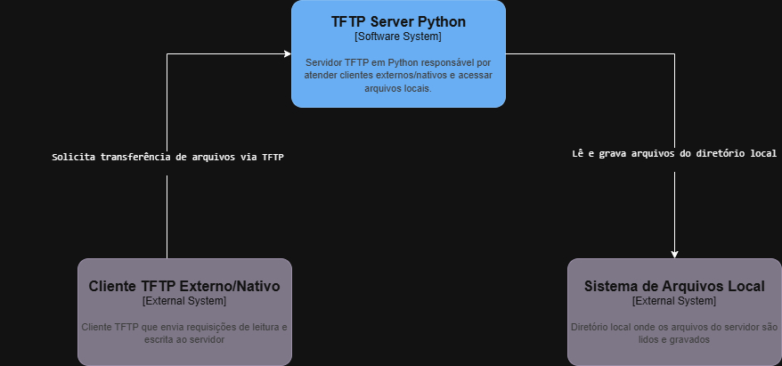
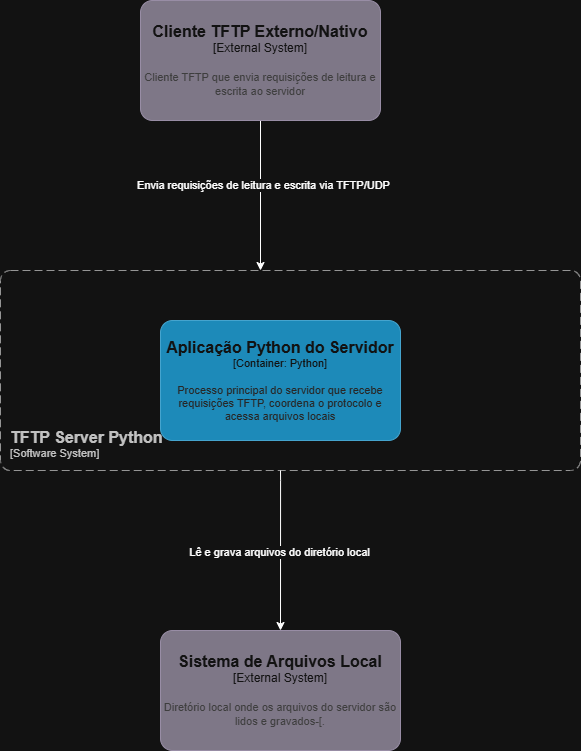
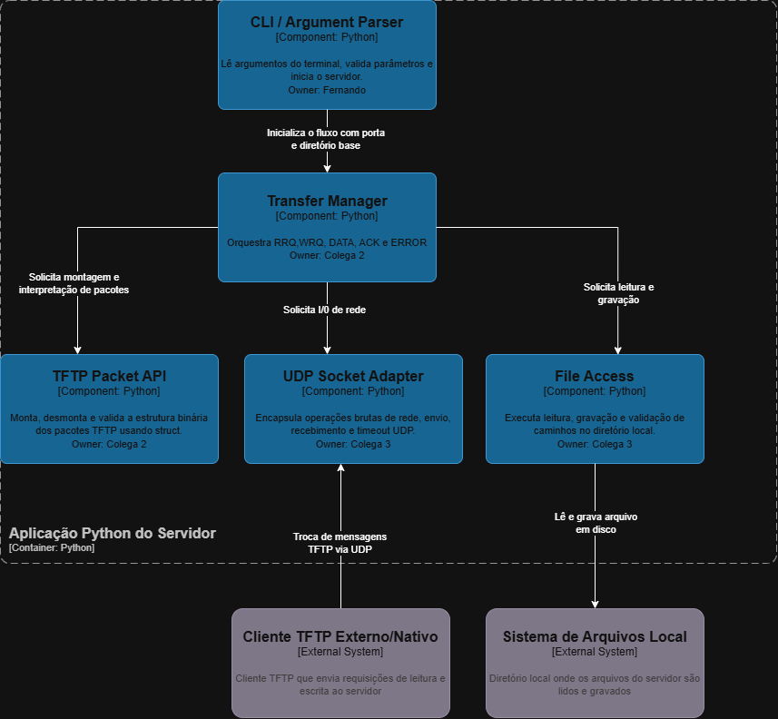

# TFTP Server Python

Servidor TFTP em Python, alinhado à [RFC 1350](https://www.rfc-editor.org/rfc/rfc1350). O código segue o modelo C4 em três níveis (rede, protocolo e disco em módulos separados).

## Objetivo

Atender clientes TFTP reais, com RRQ e WRQ conforme a RFC, mantendo fronteiras entre componentes como no diagrama nível 3.

## C4

Em `docs/c4/` devem ficar os `.drawio` com os nomes `nivel-1-contexto`, `nivel-2-container`, `nivel-3-componentes`. Os PNG exportados com o mesmo prefixo alimentam as imagens abaixo.







## Componentes

**CLI** — argumentos e arranque; sem socket nem ficheiros.

**Transfer manager** — estado e fluxo RRQ, WRQ, DATA, ACK, ERROR; usa packet API, adaptador UDP e file access.

**TFTP packet API** — `struct`, parsing e construção de pacotes; sem rede nem disco.

**UDP socket adapter** — datagramas; sem semântica TFTP.

**File access** — I/O binário dentro do diretório raiz; sem pacotes nem sockets.

Contratos entre módulos: `INTERFACE.md`.

## Estrutura

```text
tftp-server-python/
├── docs/c4/
├── INTERFACE.md
├── README.md
├── src/tftp_server/
│   ├── __init__.py
│   ├── server.py
│   ├── cli.py
│   ├── transfer_manager.py
│   ├── packet_api.py
│   ├── udp_adapter.py
│   ├── file_access.py
│   └── errors.py
└── tests/
    ├── unit/
    └── integration/
```

## Execução

Na raiz do repositório:

```bash
pip install -e .
python -m tftp_server.server --root caminho/para/diretorio
```

O `transfer_manager` ainda não está implementado; o comando valida argumentos e termina com `NotImplementedError` até o colega 2 fechar o `serve`.

Opções: `--host` (default `0.0.0.0`), `--port` (default `69`), `--root` (obrigatório).
